# KotlinLogger

###### Pretty print logs based on Log4j levels
## Features
- File, class, function and line
- Clickable text (file:number) to open the file with the line focused
- JSON pretty-printing support
- Based on Kotlin serialization

Note: You can configure the ANSI colors in the IntelliJ IDEA settings (search `ANSI` to find it)

## Download
- Groovy:
```groovy
implementation 'com.javiersc.kotlinlogger:jvm:0.0.5'
implementation 'org.jetbrains.kotlinx:kotlinx-serialization-runtime:0.20.0'
```
- Kotlin DSL
```kotlin
implementation("com.javiersc.kotlinlogger:jvm:0.0.")
implementation("org.jetbrains.kotlinx:kotlinx-serialization-runtime:0.20.0")
```
Serialization runtime dependency is necessary for the JSON pretty-printing support

## String usage
```kotlin
logA("Your message")
logD("Your message")
// and more...
```

| Level     | Image                                | 
| ---       | ---                                  |
| All       | 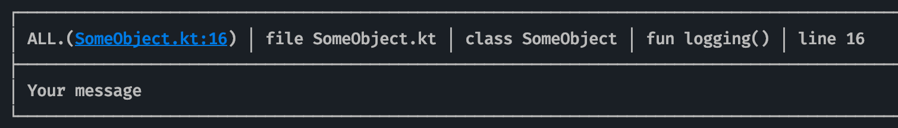 |
| Debug     | 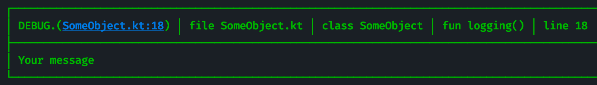 |
| Info      | 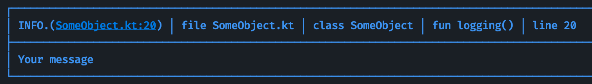 |
| Warning   | 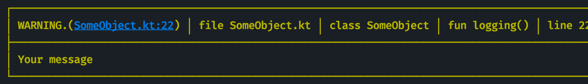 |
| Error     | 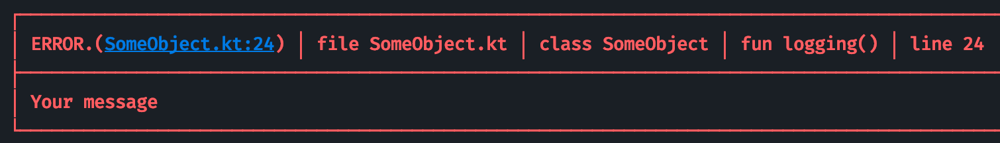 |
| Fatal     | 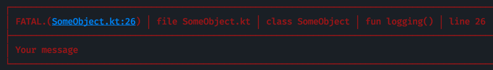 |
| Off       | 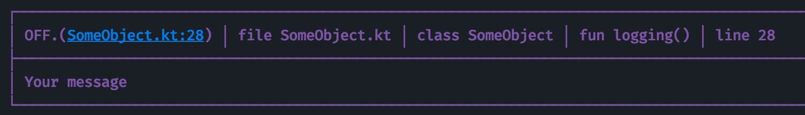 |
| Trace     | 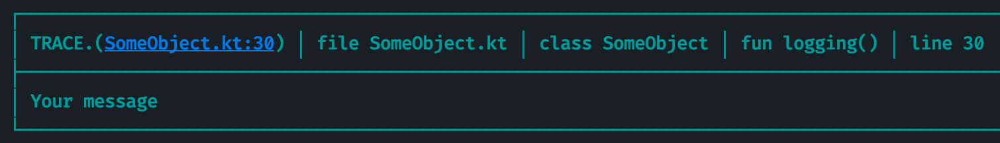 |

## JSON usage
You have all levels for JSON printing too

### String
```kotlin
// json strings
val userString =
        """
           {
              "name": "Mike",
              "age": 22,
              "surnames": [
                    "Football",
                    "Reading"
              ]
           }
        """
jsonA(userString)

//Line breaks, spaces and similar are not necessary
val userString = """{"name":"George", "age":20, "hasCar":false}"""
jsonA(userString)
```
### Serializable
```kotlin
// data class with Kotlin Serialization
@Serializable
data class User(val name: String, val age: Int, val hobbies: List<String>)

val user = User("John", 19, listOf("Tennis", "Coding"))
jsonA(user)
```

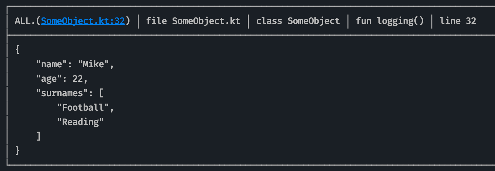

### Background color logs

#### Usage
```kotlin
logAA("Your message")
logDD("Your message")
// and more...
```

| Level     | Image                                | 
| ---       | ---                                  |
| All       | 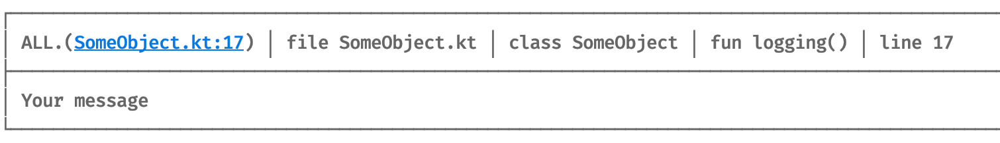 |
| Debug     | 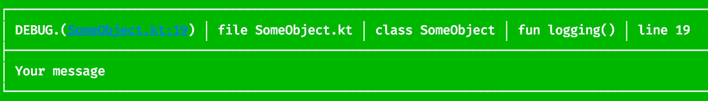 |
| Info      | 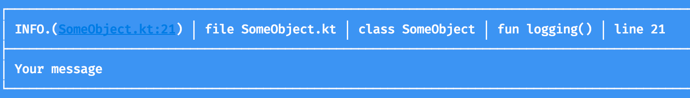 |
| Warning   | 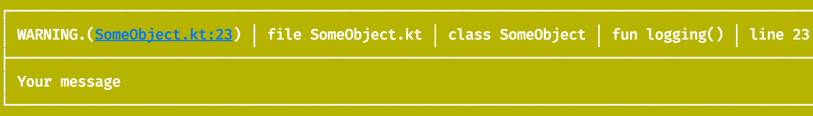 |
| Error     | 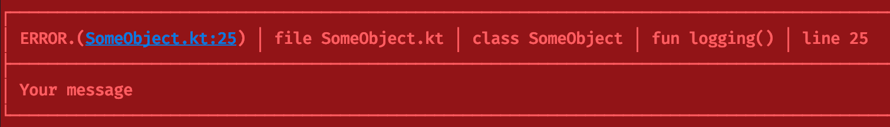 |
| Fatal     | 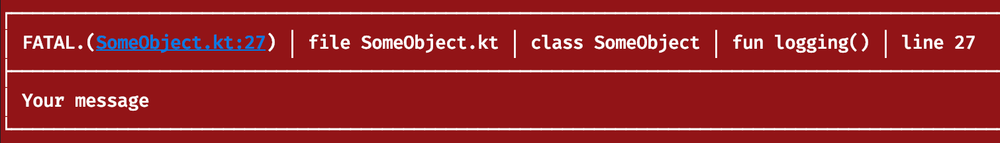 |
| Off       | 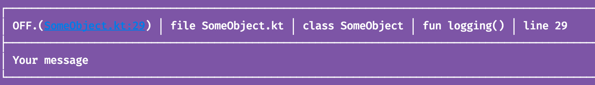 |
| TRACE     | 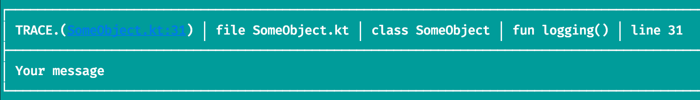 |

Similarly, you have `jsonAA(...)` to use with JSON strings or serializable data classes
